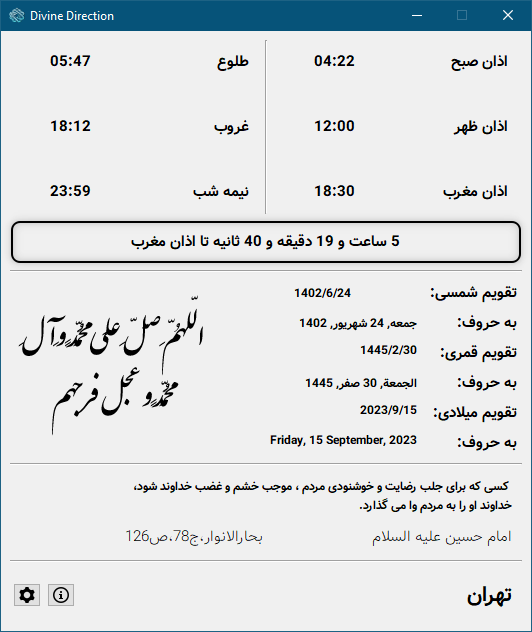

# Divine Direction
## English
“Divine Direction” is an open-source graphical program written in Python using the PyQt5 library. This program is designed for all Iranians living in Iran.

## How to Use the Python version:
1. First, download this project with the command: `git clone https://github.com/Erfan-Times/Divine-Direction`
2. Then, in the address bar of File Explorer, type `CMD` to open the Command Prompt in this folder.
3. In the Command Prompt, write the command: `cd Divine-Direction`
4. In the Command Prompt, write: `pip install -r requirements.txt`
5. Open the file `Divine Direction.py`

## How to Use the Exe version
comming soon

## Persian
یک برنامه گرافیکی منبع باز است که در پایتون با استفاده از کتابخانه PyQt5 نوشته شده است. این برنامه برای تمامی ایرانیان مقیم ایران طراحی شده است.

## نحوه استفاده از نسخه پایتون:
1. ابتدا این پروژه را با دستور: `git clone https://github.com/Erfan-Times/Divine-Direction` دانلود کنید.
2. سپس در نوار آدرس File Explorer عبارت `CMD` را تایپ کنید تا Command Prompt در این پوشه باز شود.
3. در Command Prompt، دستور را بنویسید: `cd Divine-Direction`.
4. در Command Prompt، بنویسید: `pip install -r requires.txt`.
5. فایل `Divine Direction.py` را باز کنید

## نحوه استفاده از نسخه Exe
به زودی
